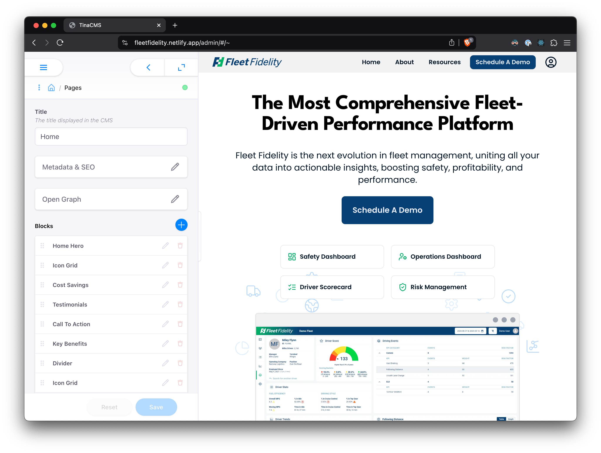
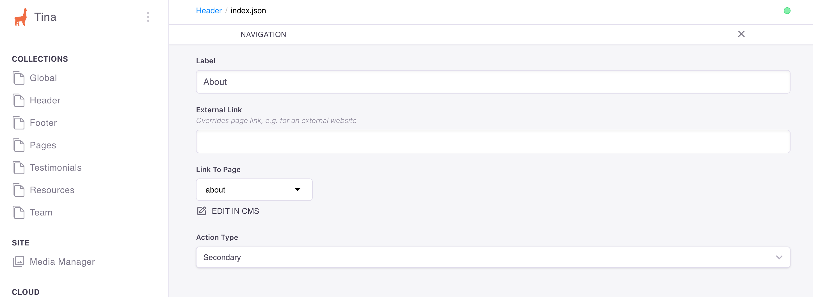

# Content Authors

These docs provide high level instructions and details for using Tina CMS. For FAQ and troubleshooting, refer to the [README](../README.md) for details.

[Looking for developer docs? ➡️](developers.md)

Table of Contents

- [Prerequisites](#pre-requisites)
- [Sign Up/Login](#sign-uplogin)
- [Navigation](#navigation)
- [CMS concepts](#cms-concepts)
- [Rolling back changes](#rolling-back-changes)

## Pre-requisites

To use the site CMS, you should already have access to a Tina account associated with the website. If you do, great! If not, ask Right Warp or someone on your team who might have access already to add you to the project as an admin.

## Sign Up/Login

To use the CMS, visit the root URL of your website and add `/admin` to the end. This will take you to a login prompt, like so:

Which will then take you over to a login form:

Once you're signed in, you will be forwarded to the home page of the site in visual editing mode:

## Navigation

Tina is structured similar to other CMS tools. It has two viewing modes: admin view and visual editing view.

### Admin view

The admin view simply means there is no side-by-side editing associated with a page of the website.

### Visual editing view

Visual editing, however, shows the page you are editing in real time.

### Content structure

To see all of the CMS's content, select the menu icon on the top left of the page.

Doing so will reveal the primary CMS navigation menu.

Here's a breakdown of the menu sections:

- `Collections` refers to the data you can edit on the site.
- `Site` refers primarily just to the media manager - it is shared across all content.
- `Cloud` refers to account management.

#### Collections

As mentioned, all website content lives here.

- `Global`: This content is used site-wide. It contains things like default meta tags, the GTM ID value, open graph images, icons, as well as the site name which is used in the title for every page.
- `Header` and `Footer`: Content related to the site's global navigation, such as logos and links to other pages.
- `Pages`: As it suggests: content for each discrete page. You can also add pages here, but more on that later.

All the other collections are shared data used across multiple pages, or that need dedicated editing experiences (such as the team and resources).

#### Media manager

You can edit every image or asset from this page. Be careful when deleting images from here unless you're absolutely sure they're not referenced elsewhere.

#### Project config

This redirects to your Tina account to manage users, data, and the repository connection.

## CMS concepts

These concepts should be enough to enable any CMS manager/content author the ability to edit page content with relative ease.

### Editing basics

Editing content in the CMS is straightforward thanks to its intuitive UI. A few key areas to call out when viewing any Collection in the CMS:

Global collections, like `Global`, `Header` and `Footer`, always open in the admin view.

All other collections open to a file manager view

Non-page collections with a file view will keep you in the admin panel.

---

When making a change, you will see two buttons on the bottom of the admin panel: Save and Reset. They do what you might expect.

More on editing soon.

### Pages

The `Pages` collection is the special snowflake of the bunch, as clicking on a page in the file view takes you to a visual editor (if you remember from when you first logged in).

When viewing the Pages collection, you can freely add pages to the CMS using the "Add Files" button. You can also add a folder for a nested route (e.g., `<url>/about/careers`). Take note of the file name when creating a new page (the bottom-most field).

**This should always be lowercase and dash-separated.** The `Title` field of a page is used to prefill this value. Double check it before saving.

If you save a bad file name, you can always:

- Delete the page, assuming it isn't referenced by another collection, and recreate it with a corrected file name.
- Edit the filename, again assuming it isn't referenced yet.

#### Adding pages to navigation

To add a page to visible navigation, go to `Header` or `Footer` collections and find the Navigation list.

Add an item using the blue plus icon and set the page reference from the dropdown, along with the visible label. You can optionally set an external URL using the `External Link` field. Finally, set the `Action Type`, which will almost always be `Secondary`

Be careful where the new page is ordered in the list, as the header navigation will be ordered left to right, while the footer's navigation wraps left to right _and_ top to bottom.

To remove a page, first go to the `Header` and/or `Footer` collections again and find the navigation item for the respective page. Click the trash icon to remove it.

Ensure no links from any pages or collections reference the soon-to-be-deleted page (such as call to actions). Then go to the `Pages` collection and delete the page.

If you delete a page and the site fails to update, there was probably a build error. See [troubleshooting](../README.md#troubleshooting) for details.

### Page blocks

All page content is structured as blocks (similar to other page builder tools like Webflow or Wordpress). These are re-arrangeable, and you can add/remove blocks as desired.

The key difference however is that all blocks are pre-built, rather than full-WYSIWYG. This means their stylistic structure is predefined during development.

Each page block makes one or two presumptions about its use, such as its color scheme, typographic hierarchy, and the like. This means most blocks will use an `h2` for their main heading and a `p` for subheading (with the exception of `Hero` blocks). For this reason, most WYSIWYG fields will have limited configuration beyond bold, italics, and content.

Some data is structured into lists, including references to other collections, and all their content and assets are freely editable (such as icons).

Blocks, by their nature, are not reusable. So if you want to add a new CTA on a page, you will need to define its content at the time you add the block each time.

### References

References are how fields reference each other to prevent excessive duplication. For instance, all navigation fields are references to the `Pages` collection items.

When deleting any collection item, always ensure all references to it are removed from other pages, blocks, and fields, otherwise the website will encounter errors (or behave unexpectedly).

## Rolling back changes

If you happen to perform an action in the CMS that causes an error, you can always go back and redeploy a previous version of the site. Work with your developers to do this, otherwise you can navigate into your hosting provider and do it yourself.

TBD details Vercel vs Netlify
